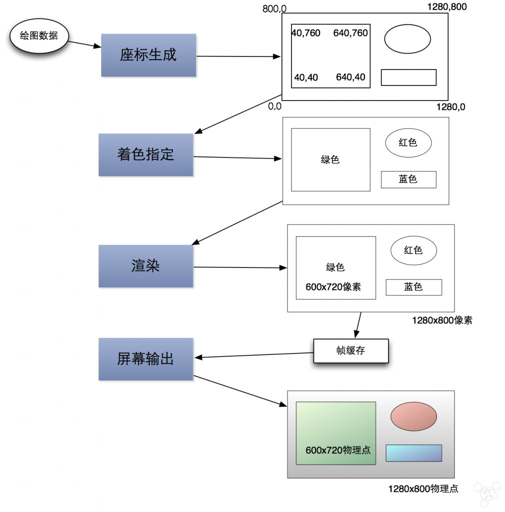

[url1]: https://bbs.feng.com/read-htm-tid-6880069.html

[原文链接][url1]

计算机的绘图过程可以简单用流水线来说明，而产品（数据）就是经过流水线作业（渲染）到屏幕的图像。这条流水线可以简化为（本文的概念）：绘图位置座标指定；着色指定；输出指定；图1简单解释了这一个流水线过程。计算机绘图需要一个输入绘图数据，这个数据可以是用户指定的，也可以是操作系统决定的，也可以是混合的。这些数据是分组的。

座标生成：当绘图数据送入座标生成系统后，流水线就会对其进行座标分派，图1右上的线框图抽象描述了这个过程。

着色指定：当座标系统生成出带座标的绘图数据后就需要送入着色器，着色器指定了这些线框的填充颜色或纹理。

渲染：着色器将绘图数据加上着色数据后就被送入渲染器，渲染器根据绘图数据描述，将像素填充到描述的线框组里并送入帧缓存，然后然后送入显示器，显示器获取到帧缓存的数据后再根据数据的描述来绘图到屏幕上。

### 像素与点（point）与点（dot）

像素与点（point），点（dot）这三个单位很容易令人混淆，原因在于它们在很多场合上是可以互换的。但是本文需要区分这两者的概念。

像素指的是一种数据结构，这个数据结构包含了RGB三个数据，分别对应的是红色，绿色，蓝色。我们说一张计算机生成的位图时，我们会说这图是多少像素x多少像素，例如800x600像素。值得注意的是，像素没有一个固定的尺寸单位，它只是一个抽象概念。

点（dot）指的是显示器屏幕的点或打印的点，是具体指代的事物。我们想说的DPI即dot per inch，每英寸多少个点。一般来说1个点对应一个像素，常见的打印尺寸是72DPI，即每英寸72点，也就是包含72个像素的数据。当像素被计算机输出成点投射都屏幕或纸面上时，它才具备了尺寸的概念，即点（dot）。

点（point）指的是座标点，是一个数据结构，包含了两个数据（或三个）X和Y(和Z)座标。绘图数据里是包含了这个座标数据的。对于没有使用HiDPI的操作系统来说，一个座标点对应一个像素。

### 点（point）不一定等于像素

一般来说，点（dot）与像素是可以互换指代的，而且我们在Retina的概念被提出前一直这样使用它们。但是，现在这两个概念必须要区分出来。像素只是一个描述RGB的数据结构，它没有任何尺寸单位，它更不是一个矩形。当像素被输出到屏幕或纸张上时，我们应该用点来指代这种含有颜色，有尺寸的具体事物。

普通的显示屏幕或打印机，我们会说屏幕上的一个点（dot）是由一个像素（RGB数据）组成的，打印后的点是由一个像素经过色彩转换（CMYK数据）组成的。

对于打印机来说，一般的DPI是72。也就是指我们在显示器屏幕上看到720x720像素的位图，在打印出来后的面积是10x10英寸，但是屏幕上的位图面积并不会跟打印出来的面积一致。因为屏幕上的一个点与打印的点的尺寸不一样。

PPI指的是每英寸多少像素，与DPI有一定概念上的区别。PPI一般指的是屏幕的点密度，DPI指的是打印点的密度。PPI不是固定的，不同屏幕尺寸结合不同的分辨率会有不同的PPI，但是DPI则是相对固定在72。

HiDPI是苹果的一项绘图技术，结合这种技术，计算机座标系统上的一个点（point）不再对应一个像素，一般来说会是一个座标点对应四个像素，而一个像素对应屏幕的一个物理点（dot）。

由于像素是一组色彩数据，所以绘图数据在经过着色器后才包含了它。举个例子，绘图数据在送入着色器前是描述一个100x100的矩形，经过着色器指定色彩属性后会被送入一个HiDPI系统，这个系统将200x200个像素的数据添加到绘图数据里。在经过渲染器后，相当于将200x200个像素填充进100x100这个矩形线框。

### 帧缓存与显示器屏幕

帧缓存是储存计算机渲染后的图形数据的，这些数据包括座标，像素，分辨率等等。。简单来说就是描述图象的数据，当这些描述数据送入显示器后，显示器就知道怎么绘图了。

一般来说的屏幕分辨率指的是渲染器生产出来的像素数据排列，例如1280x800像素。值得注意的是这个屏幕分辨率与显示器屏幕的物理点排列没关系的。屏幕分辨率是可设置的，显示器的物理点排列是固定的。例如帧缓存里的分辨率是1280x800像素，但是显示器屏幕是1920x1200点排列的，那么显示器会怎么将帧缓存里的数据呈现到屏幕上呢？答案是通过自适应放缩，是经过显示器内部芯片来转换的。

13寸的RMBP在分辨率设置里是这样描述的，看起来像1280x800像素，看起来像1440x900像素。我们需要这样理解，1280x800像素是相对于旧款不带Retina的机器，也就是绘图数据送入着色器前的座标系统与渲染后的座标是1:1对应的参考值。实际上在经过渲染后，它的实际像素是2560x1600，也就是帧缓存里是数据是2560x1600像素。同样地看起来1440x900像素实际渲染后的像素是2880x1800。由于13寸的屏幕实际点排列是2560x1600，所以帧缓存2880x1800像素在输出到屏幕后会被自适应缩放掉。

### DPI与Retina

操作系统标准的桌面打印DPI是72，但是随着HiDPI技术和高PPI屏幕出现后，这个标准也许会有一定的变化。我们在Retina的OS X下用Photoshop新建一个文件时默认的DPI指定在144上了，这是标准转变的一个信号。

在没有使用类似HiDPI技术的操作系统上，屏幕分辨率对应的打印DPI是72。使用HiDPI的Retina机器的打印DPI是144，用以保证在统一尺下具有更多的点密度。这点对于印前工作非常重要。

