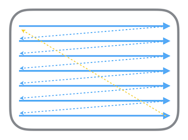
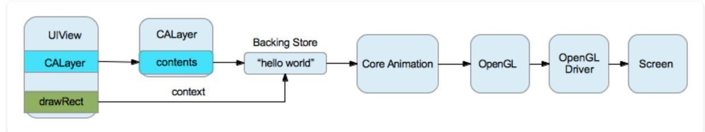
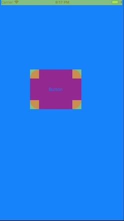
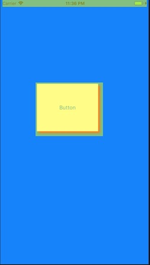

[ibireme_url]: https://blog.ibireme.com
[code_url]: https://snippets.cacher.io/snippet/6450c5ef0cf37484bb58
这篇文章主要是总结一下我对离屏渲染的理解，之前一直不太理解离屏渲染到底是个什么，也不太理解为什么他会引起滚动界面卡顿，一直也没有去深入了解，自己也深感惭愧。以前看到了[@ibireme][ibireme_url]写的[iOS 保持界面流畅的技巧](https://blog.ibireme.com/2015/11/12/smooth_user_interfaces_for_ios/)这篇文章，里面也描述了下屏幕显示原理。现在再次深入阅读，才比较理解离屏渲染到底是怎么回事。


### 屏幕显示原理

引用一下[@ibireme][ibireme_url]的原文
>
>首先从过去的 CRT 显示器原理说起。CRT 的电子枪按照上面方式，从上到下一行行扫描，扫描完成后显示器就呈现一帧画面，随后电子枪回到初始位置继续下一次扫描。为了把显示器的显示过程和系统的视频控制器进行同步，显示器（或者其他硬件）会用硬件时钟产生一系列的定时信号。当电子枪换到新的一行，准备进行扫描时，显示器会发出一个水平同步信号（horizonal synchronization），简称 HSync；而当一帧画面绘制完成后，电子枪回复到原位，准备画下一帧前，显示器会发出一个垂直同步信号（vertical synchronization），简称 VSync。显示器通常以固定频率进行刷新，这个刷新率就是 VSync 信号产生的频率。尽管现在的设备大都是液晶显示屏了，但原理仍然没有变。

>CPU 计算好显示内容提交到 GPU，GPU 渲染完成后将渲染结果放入帧缓冲区，随后视频控制器会按照 VSync 信号逐行读取帧缓冲区的数据，经过可能的数模转换传递给显示器显示。
>



> 在最简单的情况下，帧缓冲区只有一个，这时帧缓冲区的读取和刷新都都会有比较大的效率问题。为了解决效率问题，显示系统通常会引入两个缓冲区，即双缓冲机制。在这种情况下，GPU 会预先渲染好一帧放入一个缓冲区内，让视频控制器读取，当下一帧渲染好后，GPU 会直接把视频控制器的指针指向第二个缓冲器。如此一来效率会有很大的提升。

这里介绍了 GPU 为了效率问题，使用了两个帧缓冲区。对于帧缓冲区的个数，iOS 系统中使用的是双缓冲机制，而 Android 使用的三缓冲机制。题外话，不得不佩服 iOS 系统的设计，在硬件不如 Android 的提前下，界面的流畅度却超过 Android 机器。


### 离屏渲染

直接引用网络上的一段文字：

> OpenGL中，GPU屏幕渲染有以下两种方式：
> 1. **On-Screen Rendering** 意为当前屏幕渲染，指的是GPU的渲染操作是在当前用于显示的屏幕缓冲区中进行。
> 2. **Off-Screen Rendering** 意为离屏渲染，指的是GPU在当前屏幕缓冲区以外新开辟一个缓冲区进行渲染操作。

对于一个 UIView 的渲染过程：
> 1. UIView的layer层有一个content，指向一块缓存，即backing store
> 2. UIView绘制时，会调用drawRect方法，通过context将数据写入backing store
> 3. 在backing store写完后，通过render server交给GPU去渲染，将backing store中的bitmap数据显示在屏幕上
>



当我们在使用**Group Opacity**、**corner（圆角）**、**shadow（阴影）**、**edge antialiasing（抗锯齿）**和**mask**等视图功能的时候，由于图层不是那种简单的覆盖，而是需要额外计算图层的显示关系，由于当前已经是 GPU 渲染了，所以在 GPU 的当前屏幕缓冲区外，新建了一个缓冲区，在这个缓冲区中，去进行这些额外的渲染，这就是离屏渲染。

1. 创建离屏缓冲区是一个代价是很大的。
2. （假设我们的在界面中画了圆角），如果我们创建的圆角 N 个，那么在这个离屏缓冲区中，去处理这 N 个圆角的时候，会大量的切换上下文，然而，切换上下文也是一个代价非常大的操作。

所以，当在开发过程中，**如果离屏渲染没有处理好，对 App 的性能影响是非常大的**， 后文会有相关的实例对比。


### 离屏渲染的优化
* 尽量使用当前屏幕渲染。由于离屏渲染、CPU渲染可能带来的性能问题，一般情况下，尽量使用当前屏幕渲染。
* 由于 GPU 的浮点运算能力比 CPU 强，虽然 CPU 渲染的效率不如 GPU，但有时使用 CPU 渲染的效率会比 GPU 离屏渲染好，毕竟离屏渲染要涉及到缓冲区创建和上下文切换等耗时操作。

#### 圆角

一般情况，我们写圆角的时候，会这样写：

```Objective-C
    view.layer.cornerRadius = 10;
    view.layer.masksToBounds = YES;
```

运行时，查看 Off-screen Rendered



我们可以看到按钮上的四个角被黄色覆盖，表明这四个角被离屏渲染了，这是因为 GPU 渲染的时候，发现这个按钮不是一个规整的图形，不能简单的采用(x, y, width, height)的规则进行渲染，对于上面的四个角，必须进行离屏渲染，新建一块缓冲区进行计算渲染，和下一层的 layer 进行合成处理，这样才能再界面上形成一个有弧度的视觉效果。

然而这里只有四个角所处的矩形范围进行了离屏渲染，是因为计算机里面的图形坐标都是以类似于(x, y, width, height)的规则来描述的，也就是说是一个矩形图形。然而这儿不是整个按钮而只是其他的四个角的区域的原因，是因为效率问题，GPU 确定除了四个角所在的矩形区域之外， 其他的区域都不需要合成处理，这样选择性的进行离屏渲染，能够获得更高的性能。

这里我们如何处理圆角带来的离屏渲染呢？答案是采用 Core Graphics 提供的函数，在 CPU 里面绘制圆角，这样相当于在 CPU 处理的时候就已经 GPU 离屏渲染做的事情给完成了。

使用下面提供的代码能够给 UIView 的子类添加圆角，能够避免离屏渲染。

```Objective-C
  // 仅添加圆角
  [view addCorner:30];
  // 添加圆角和边框
  [view addCorner:30 borderWidth:0.5 borderColor:[UIColor redColor]];
```

由于`addCorner:`和`addCorner:borderWidth:borderColor:`的代码较长，需要查看和下载的，[请点击此处查看下载][code_url]


#### 阴影

对于 shadow 来说，

```Objective-C
  view.layer.shadowColor = [UIColor redColor].CGColor;
  view.layer.shadowOffset = CGSizeMake(5, 5);
  view.layer.shadowOpacity = 1.0;
```

查看 Off-screen Rendered



可以看到，整个 view 的 frame，包括 frame 之外还有一点都进行了离屏渲染。

这儿有一个问题，如果有谁知道，请在评论区讲解一下。**为什么是整个 view 都被离屏渲染了呢？** 为了效率中间的区域可以不需要被离屏渲染，但是对于 shadow 却被离屏渲染了？

对于 shadow 的优化，直接在上面的代码后面添加一句就行了

```Objective-C
  view.layer.shadowColor = [UIColor redColor].CGColor;
  view.layer.shadowOffset = CGSizeMake(5, 5);
  view.layer.shadowOpacity = 1.0;
  // 添加 shadowPath，能够解决离屏渲染
  view.layer.shadowPath = [UIBezierPath bezierPathWithRect:view.bounds].CGPath;
```


#### Mask

一般的 Mask 设置代码如下：

```Objective-C
  UIImageView * mask = [[UIImageView alloc] initWithFrame:view.bounds];
  mask.image = [UIImage imageNamed:@"mask.png"];
  view.maskView = mask;
```

对于 Mask 的优化，其实并没有一个很好的方式来解决，目前的解决方案是：rasterize（光栅化），然而 rasterize（光栅化）也会造成离屏渲染，不过由于离屏渲染大部分时候会在大量出现的时候造成性能问题，所以在滚动页面进行 rasterize（光栅化）的时候，会将光栅化后的内容缓存起来，如果对应的layer及其sublayers没有发生改变，在下一帧的时候可以直接复用, 把GPU的操作转到CPU上了，生成位图缓存，各种阴影遮罩等效果也会保存到位图中并缓存起来，直接读取复用，从而减少渲染的频度。rasterize（光栅化）有一个不好的效果，会造成文字 label 视觉效果模糊。
