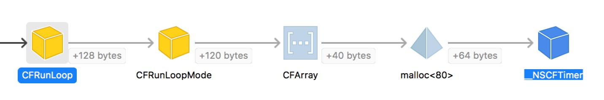

[CFRunLoop_URL]: https://opensource.apple.com/source/CF/CF-1153.18/CFRunLoop.c

最近在调试 NSTimer，发现了一些有趣的东西，在此文分析研究一下。

### 问题
一个 viewController，持有了一个 timer, 当不需要这个 timer 的时候，能不能只调用 `self.timer = nil;`？

### 什么是 NSTimer？

根据 Apple 的开源代码 [CFRunLoop.c][CFRunLoop_URL] 的定义，NSTimer 对应着一个 __CFRunLoopTimer 的结构体，具体代码如下：

#### __CFRunLoopTimer

```
struct __CFRunLoopTimer {
    CFRuntimeBase _base;
    uint16_t _bits;
    pthread_mutex_t _lock;
    CFRunLoopRef _runLoop;
    CFMutableSetRef _rlModes;
    CFAbsoluteTime _nextFireDate;
    CFTimeInterval _interval;		/* immutable */
    CFTimeInterval _tolerance;          /* mutable */
    uint64_t _fireTSR;			/* TSR units */
    CFIndex _order;			/* immutable */
    CFRunLoopTimerCallBack _callout;	/* immutable */
    CFRunLoopTimerContext _context;	/* immutable, except invalidation */
};

```

可以看到 __CFRunLoopTimer 里面有一个`CFRunLoopRef _runLoop`，这个表示 timer 是属于哪一个 runLoop 的，而里面的`CFMutableSetRef _rlModes`则表示这个 timer 是在 runLoop 的哪些 mode（__CFRunLoopMode） 中生效。

同时我们也能看到 __CFRunLoopTimer（即 NSTimer） 使用的是 pthread_mutex_t 锁。


#### __CFRunLoopMode

```
struct __CFRunLoopMode {
    CFRuntimeBase _base;
    pthread_mutex_t _lock;	/* must have the run loop locked before locking this */
    CFStringRef _name;
    Boolean _stopped;
    char _padding[3];
    CFMutableSetRef _sources0;
    CFMutableSetRef _sources1;
    CFMutableArrayRef _observers;
    CFMutableArrayRef _timers;
    CFMutableDictionaryRef _portToV1SourceMap;
    __CFPortSet _portSet;
    CFIndex _observerMask;
#if USE_DISPATCH_SOURCE_FOR_TIMERS
    dispatch_source_t _timerSource;
    dispatch_queue_t _queue;
    Boolean _timerFired; // set to true by the source when a timer has fired
    Boolean _dispatchTimerArmed;
#endif
#if USE_MK_TIMER_TOO
    mach_port_t _timerPort;
    Boolean _mkTimerArmed;
#endif
#if DEPLOYMENT_TARGET_WINDOWS
    DWORD _msgQMask;
    void (*_msgPump)(void);
#endif
    uint64_t _timerSoftDeadline; /* TSR */
    uint64_t _timerHardDeadline; /* TSR */
};
```

从 __CFRunLoopMode 的源代码中， 我们可看到里面包含着一个`CFMutableArrayRef _timers`，也就是说 runLoopMode 有一个存放 timer 的数组，即当我们指定一个 timer 的 runLoopMode 的时候，`[[NSRunLoop currentRunLoop] addTimer:timer forMode:NSDefaultRunLoopMode]`， 会把这个 timer 放入相应的 runLoopMode 对象中。也就是说这个 runLoopMode 对象里面的 _timers 数组，会持有这个 timer 对象。这一点可以从 Xcode 的 Memory Graph中看到

当我们不需要一个 timer 的时候，我们是使用 NSTimer 的一个方法 `invalidate` 来进行解除所有和这个 timer 相关的持有关系。

同样我们也能看到 __CFRunLoopMode 使用的也是 pthread_mutex_t 锁。


#### 回答前面的问题

**当我有一个 viewController，持有了一个 timer, 我能不能只调用 `self.timer = nil;`?**
> 不能，因为 `self.timer = nil;` 只是解除了 viewController 持有 timer，但是并没有解除 runLoopMode 里面的数组持有 timer 的关系，所以必须调用invalidate来解除所有和 timer 相关的关系。
