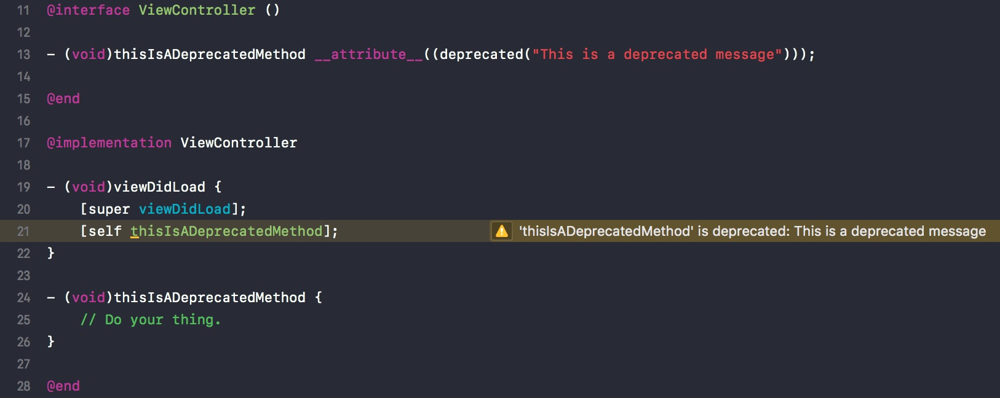
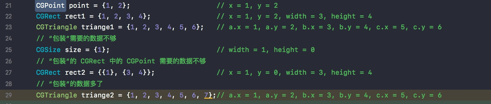
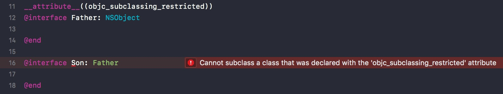
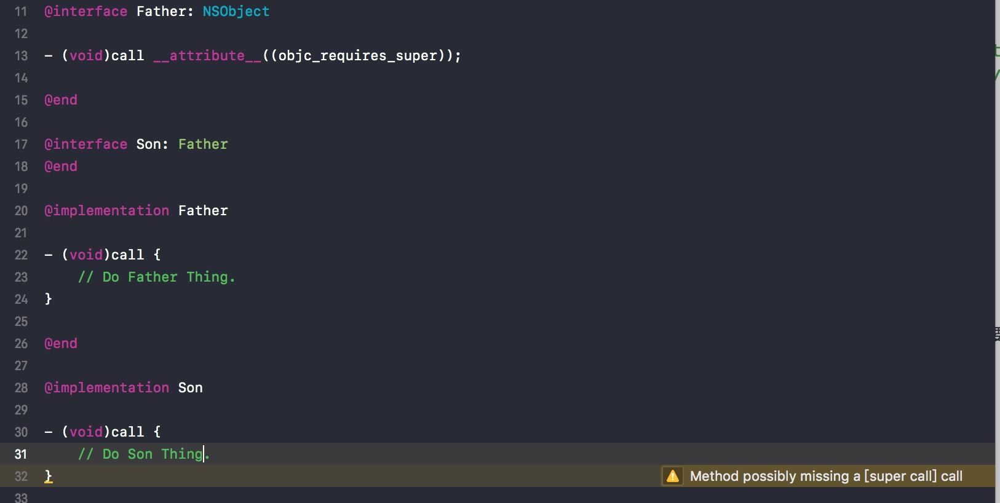
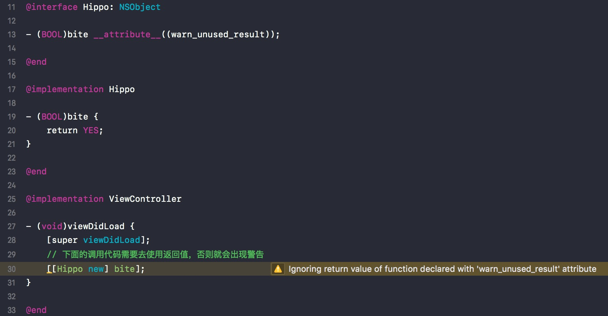
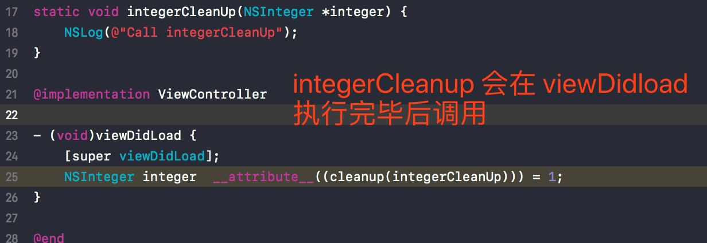
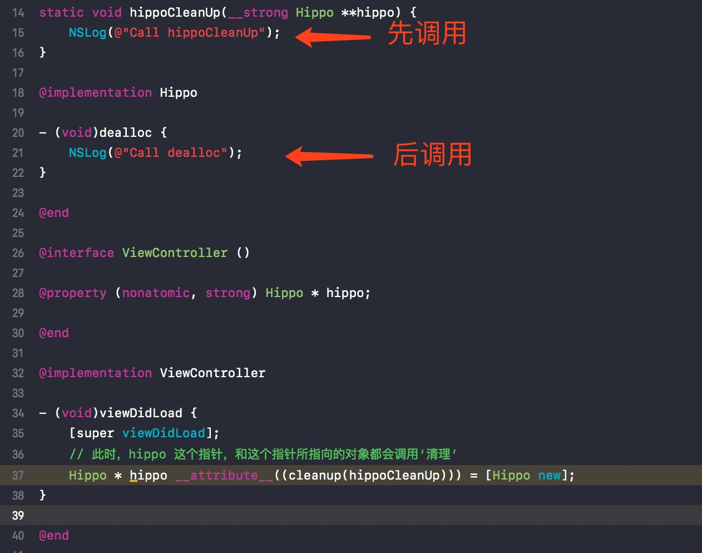
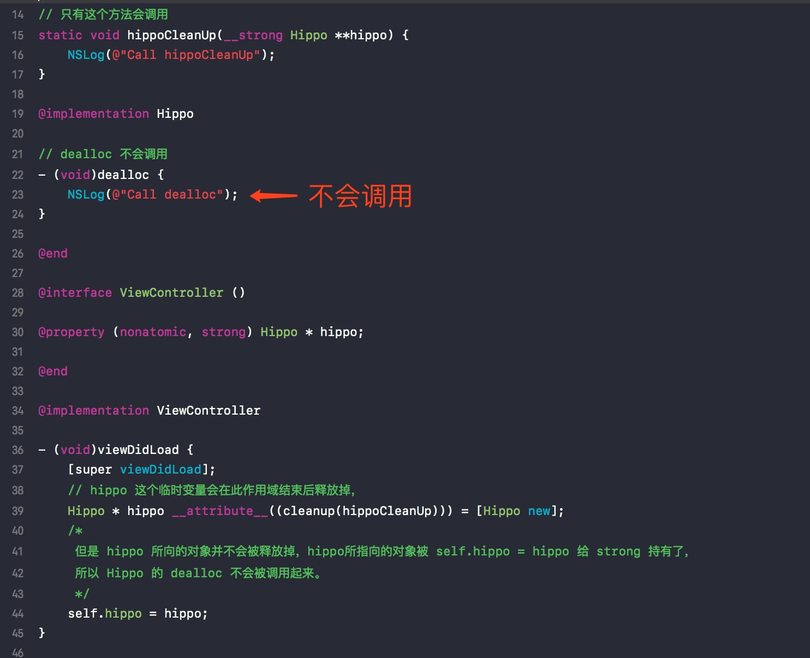

[URL_Ref1]: http://nshipster.com/__attribute__/
[URL_Ref2]: http://blog.sunnyxx.com/2016/05/14/clang-attributes/
[URL_Ref3]: http://blog.sunnyxx.com/2014/09/15/objc-attribute-cleanup/
### 序

最近查看在网上发现了个有趣的小玩意`__attribute__`, 也就是 Clang Attributes，这是一个编译器提供的功能，能够让我向编译器指定一些特殊的功能，比如

* __attribute__((deprecated))：描述一个方法已经废弃；
* __attribute__((objc_requires_super))：描述子类继承父类的方法时需要调用 super方法；
* __attribute__((cleanup(...))): 描述一个变量在作用域结束时能够执行指定方法；
* ......

Clang 编译器提供了很多的 `__attribute__` 功能，下面会介绍一些 Objective-C 中常用的一些功能。

可以参考相关的文章 [NShipster][URL_Ref1] 和 [clang-attributes][URL_Ref2]。


###  \_\_attribute__((deprecated))

描述一个**方法**，表明这是一个被废弃的方法，如果有地方在调用，编译器会提示一个警告；并且也提供自定义警告信息，格式如下__attribute__((deprecated("meesage")))

```
- (void)thisIsADeprecatedMethod __attribute__((deprecated("This is a deprecated message")));
```

在 Xcode 中，我们编写代码的时候， 编辑器会和 Clang 编译器的预编译系统配合，在我们写代码的时候，就在 IDE 中把警告给显示出来。




### \_\_attribute__((objc_boxable))

能够给 struct 和 union 提供快捷的“包装”方式。

1. CGRect， CGSize， CGPoint, CGVector 能够使用框架提供的 boxable 快速“包装”；
2. 自定义 struct 或 union 类型，也可以添加 __attribute__((objc_boxable)) 以支持 boxable 快速“包装”。

```Objective-C

CGPoint point = {1, 2};                     // x = 1, y = 2
CGRect rect1 = {1, 2, 3, 4};                // x = 1, y = 2, width = 3, height = 4
CGTriangle triange1 = {1, 2, 3, 4, 5, 6};   // a.x = 1, a.y = 2, b.x = 3, b.y = 4, c.x = 5, c.y = 6
// “包装”需要的数据不够，不够的数据补0
CGSize size = {1};                          // width = 1, height = 0
// “包装”的 CGRect 中的 CGPoint 需要的数据不够，不够的数据补0
CGRect rect2 = {{1}, {3, 4}};               // x = 1, y = 0, width = 3, height = 4

typedef struct __attribute__((objc_boxable)) {
    CGPoint x;
    CGPoint y;
    CGPoint z;
} CGTriangle;

CGTriangle triange = {1, 2, 3, 4, 5, 6};
// “包装”的数据多了，最后一条丢掉
CGTriangle triange2 = {1, 2, 3, 4, 5, 6, 7};// a.x = 1, a.y = 2, b.x = 3, b.y = 4, c.x = 5, c.y = 6

```

这里“包装”的方式需要注意：

  * 可以采用**平铺**，如`{1, 2, 3, 4}`，也可以采用**嵌套**，如 `{ {1, 2}, {3, 4} }`
  * 如果“包装”赋值数据的个数比定义的少，则没有赋值的部分全部为0，如`CGSize size = {1}; // width = 1, height = 0`
  * 如果“包装”赋值数据的个数比定义的多，则多余的部分丢掉。如`CGTriangle triange2 = {1, 2, 3, 4, 5, 6, 7};// a.x = 1, a.y = 2, b.x = 3, b.y = 4, c.x = 5, c.y = 6`




### \_\_attribute__((objc_subclassing_restricted))

描述一个**类**是一个不能被继承的类。

如果定义一个 Father 类，并且使用`__attribute__((objc_subclassing_restricted))`描述，那么如果一个 Son 类要去继承于 Father，编辑器会在编译器的预编译系统的帮助下，在 IDE 里面就把错误显示出来。




### \_\_attribute__((objc_requires_super))

描述一个**子类**继承父类的方法时，需要调用 super，否则给出编译警告。

如果定义一个 Father 类，里面包含一个 call 方法，并且使用`__attribute__((objc_requires_super))`描述，那么如果一个 Son 在调用 call 的时候，需要显式的调用[super call]，如果没有调用，那么编辑器会在编译器的预编译系统的帮助下，在 IDE 里面就把警告显示出来。




### \_\_attribute__((warn_unused_result))

描述一个**方法**，如果此方法有返回值，但是调用的地方**并未使用返回值**，编译器就会提示一个警告。（编辑器在编译器的预编译系统的帮助下，也会在 IDE 中显示警告）

如下面 Hippo 类的 bite 方法，使用了 `__attribute__((warn_unused_result))` 进行描述，在 bite 方法调用的时候没有使用返回值，编译器就就提示了一个警告




### \_\_attribute__((cleanup(...)))

修饰一个**变量**，在它的作用域结束时可以执行一个指定的方法。

cleanup 是一个用好了就很爽的属性，详细内容可以查看[黑魔法__attribute__((cleanup))][URL_Ref3]

#### 基本类型变量

如果一个**临时基本类型变量**，在其超出作用域之后，这个变量会直接调用 cleanup。



#### 对象变量

如果一个**临时变量对象**，在超出其作用域之后，其临时变量（变量本身）会被释放，但是其指向的对象则会根据他的生命周期来决定是否释放。也就是说：

> *  如果临时变量对象，没有被其他对象持有，那么最后其会先调用 cleanup，然后再调用 dealloc 方法
> *  如果临时变量对象，被其他对象持有了，那么其只会调用 cleanup，而 dealloc 是不会被调用的。（这是因为临时变量（变量本身）会被释放，但是其指向的对象则会根据他的生命周期来决定是否释放）

下面两个例子可以很好的阐述上面两个观点：



而下面的 hippo 对象被当前类给持有了，所以 dealloc 是不会调用的，只会调用 cleanup。




### 总结

\_\_attribute__ 提供了很多的编译时功能，恰当的运用这些功能，可以使我们的代码更加灵活。
