[URL_Ref1]: http://www.matrixprojects.net/p/uibarbuttonitem-ios11/
[URL_Ref2]: https://developer.apple.com/videos/play/wwdc2017/204/
[URL_Ref3]: #fixed-space-items

### 序


随着 iOS 11 和 Xcode 9 的发布，导航栏`UINavigationBar` 里面的控件 `UIBarButtonItem` 有一些变化，下面我们一起看看有哪些变化。

### 变化

* `UIBarButtonItems` 的custom view的点击区域更小了
* 返回按钮的点击区域也更小了
* 如果上一个屏幕的 title 有变化，则返回按钮的 label 不再自动更新（iOS 10 前会自动更新）
* `UIBarButtonSystemItemFixedSpace` 类型的 `UIBarButtonItem` 现在至少有 8 个点的最小宽度，负数的 width 不再生效
* 重写 `alignmentRectInsets` 可能会导致 custom views 超出点击区域

下面会详细的讲解上面几点变化。

### 点击区域(Tap Areas)

我们假设有一个 **iOS 10** 程序，其中包含两个有 custom view 的 `UIBarButtonItem`。然后我们使用 `Debug View Hierarchy` 去检查 custom 的真实大小。

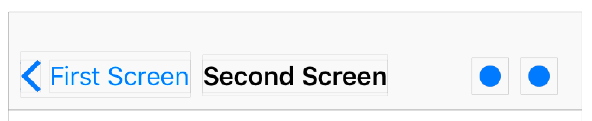

他们的点击区域实际上会更大，和下面的红色方块区域大小一致。

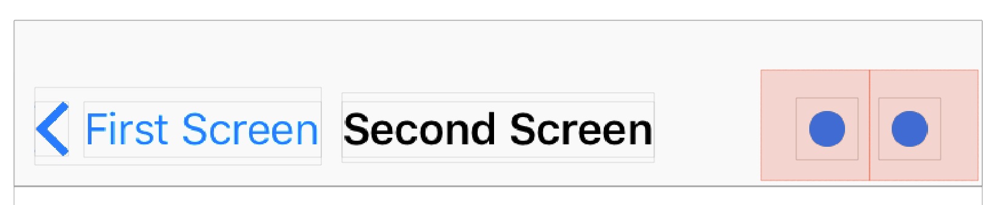

然而在 **iOS 11** 上，显示的效果和上面的效果就不同了。点击区域大小和 custom view 的大小一致。

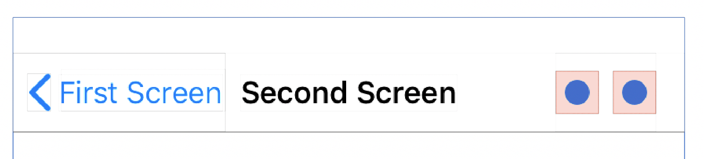

在 **iOS 11** 上，这种点击区域的大小的确会使得用户很难点击。为了扩大点击区域，custom view 的需要扩大边距。我们可以创建一个拥有最小的size 约束的 Wrapper view。

```Swift
class WrapperView: UIView {
    let minimumSize: CGSize = CGSize(width: 44.0, height: 44.0)
    let underlyingView: UIView
    init(underlyingView: UIView) {
        self.underlyingView = underlyingView
        super.init(frame: underlyingView.bounds)

        underlyingView.translatesAutoresizingMaskIntoConstraints = false
        addSubview(underlyingView)

        NSLayoutConstraint.activate([
            underlyingView.leadingAnchor.constraint(equalTo: leadingAnchor),
            underlyingView.trailingAnchor.constraint(equalTo: trailingAnchor),
            underlyingView.topAnchor.constraint(equalTo: topAnchor),
            underlyingView.bottomAnchor.constraint(equalTo: bottomAnchor),
            heightAnchor.constraint(greaterThanOrEqualToConstant: minimumSize.height),
            widthAnchor.constraint(greaterThanOrEqualToConstant: minimumSize.width)
        ])
    }
    // ...
}
```

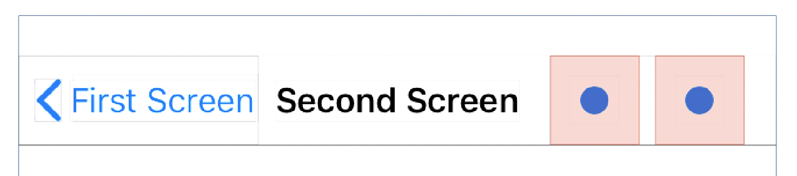


### 返回按钮(Back Button)

#### 点击区域(Tap Area)

当 view controller 的 title 很长的时候，iOS 11 上的返回按钮点击区域会变得更小。

在 iOS 10 上的返回按钮有一个比较大的最小宽度，利于用户点击。

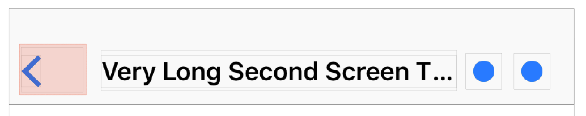

然而在 iOS 11 上，返回按钮的点击区域变得很小。更糟糕的是 view controller 的 title，有时看起来像是返回按钮的 label。

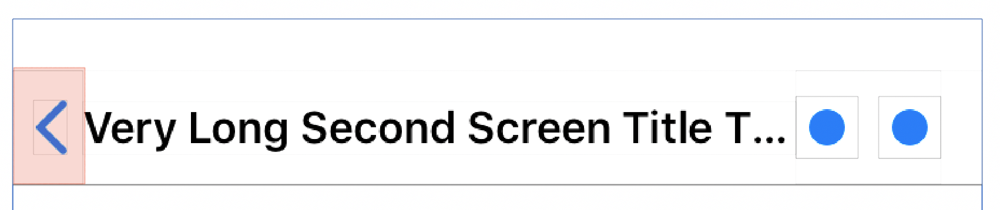

#### 动态更新(Label)

iOS 11 上面另外一个更新是返回按钮的 label。

举个例子，假设有一个能够自动更新 title 的 `First(4)` 页面 (UIViewController),

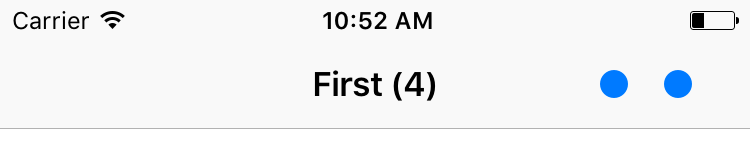

界面从 `First(4)` 页面 push 到 `Second` 页面，

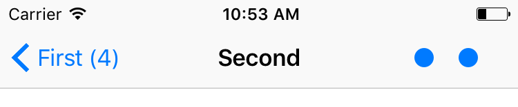

在 iOS 10 上，当 `First(4)`的 title 从 First(4) 变化到 First(6) 之后，返回按钮也变成了 First(6)，

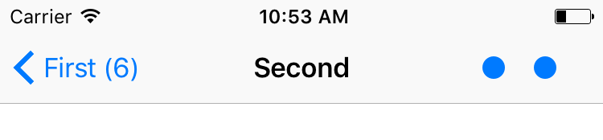

而在 iOS 11 上，返回按钮的 label 并没有自动更新，而是保持不变。

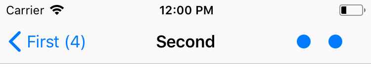

### 自动布局(Auto Layout)

`UINavigationBar` 现在能够使用自动布局（Auto Layout）来布局它的 subviews（包括 custom views）。在今年的 WWDC上中的 [Updating Your Apps for iOS 11][URL_Ref2] 里面有提到。

在 iOS 11 中，我们能够从 `Debug View Hierarchy` 检查 `UINavigationBar` 看到，`UINavigationBar` 内部的 buttons 都被放置在一个 stack view 中。

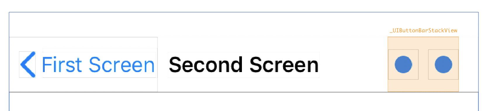

当我们正确的实现了 custom view 的 `sizeThatFits` 和 `intrinsicContentSize`，`UINavigationBar`也会如以前那样工作正常。

但是，需要注意的是，当我们把custom view 的 `translatesAutoresizingMaskIntoConstraints` 设成 `false`，在 iOS 10（如果你的 App 还支持 iOS 10的话）上，可能出现一些莫名其妙的问题。比如可能导致custom view 的 top-left 方向布局错位。这种情况下，一个简单的保护代码如下：

```
let customView = createCustomView()
if #available(iOS 11, *) {
    customView.translatesAutoresizingMaskIntoConstraints = false
}
navigationItem.rightBarButtonItem = UIBarButtonIte(customView: customView)
```

### 自定义对齐(Custom Alignment)

很多时候，我们想能够自由的控制 custom `UIBarButtonItem` 的布局（对齐），特别是和屏幕两边的边距大小。在 iOS 10（及以前）来说，我们经常用到两种小技巧：
* 使用fixed space item，即`UIBarButtonItem(barButtonSystemItem: .fixedSpace …)`，并且赋值一个负数，比如-15
* 重写 custom view 的 `alignmentRectInsets`

但是在 iOS 11 上，上面两个方法都有点变化，第一个办法已经失效，而第二个办法也有点问题。

#### Fixed Space Items

当我们使用 custom view 的时候， 默认的边距是16个点，

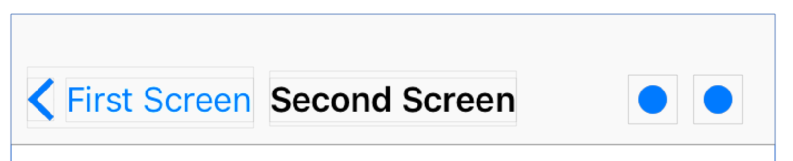

假设我们想将边距减少到 8 个点，那么在 iOS 10 上面，我们需要设置fixed space `UIBarButtonItem` 的宽度为 -8 就可以达到我们想要的效果。

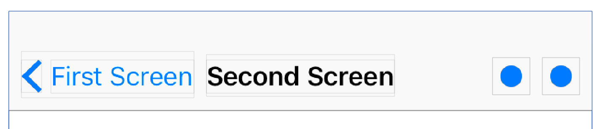

```
let spacer = UIBarButtonItem(barButtonSystemItem: .fixedSpace, target: nil, action: nil)
spacer.width = -8
let barButtonsItems = [
    spacer,
    UIBarButtonItem(customView: createCustomButton()),
    UIBarButtonItem(customView: createCustomButton())
]
navigationItem.rightBarButtonItems = barButtonItems
```


然而在 iOS 11 上，修改fixed space `UIBarButtonItem` 的宽度为 -8 会不生效。

#### Alignment Rect Insets

而重写 custom view 的 `alignmentRectInsets`，在 iOS 10 上面也能够修改布局边距

```
class CustomView: UIView {
    var alignmentRectInsetsOverride: UIEdgeInsets?
    override var alignmentRectInsets: UIEdgeInsets {
        return alignmentRectInsetsOverride ?? super.alignmentRectInsets
    }
    // ...
}
```

设置 `alignmentRectInsets` 的值为 UIEdgeInsets(top: 0, left: -8, bottom: 0, right: 8)，也能够和前面的修改起到相同的作用

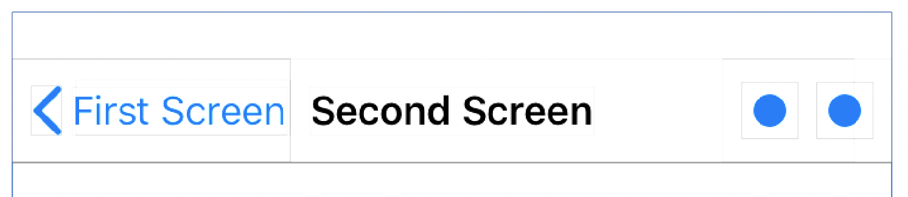

上面的代码在 iOS 11 上面依然能够起到作用，但是有一个小的问题是，item 里面有一小部分超出了 stack view 的范围。超出的区域不能点击，也就意味着点击区域变小了。

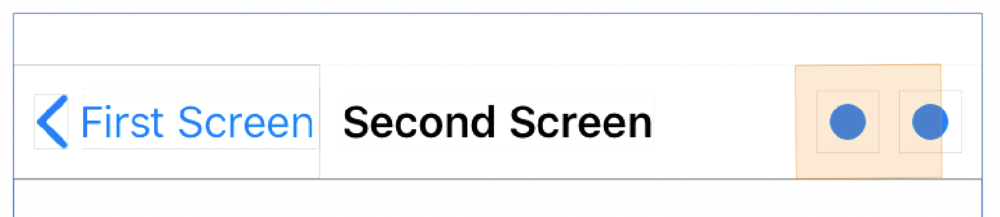

#### Workaround

根据前面[fixed space的例子][URL_Ref3]，我们发现相对于未使用 custom view 的情况，边距有所变小。

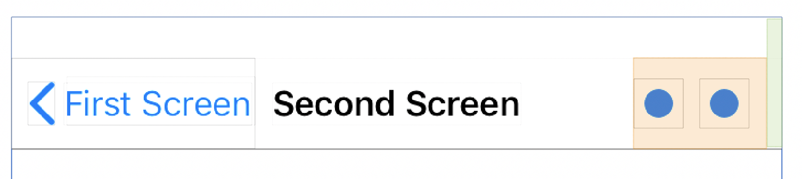

当我们未使用 custom view 的时候，边距到屏幕边缘是 8 个点

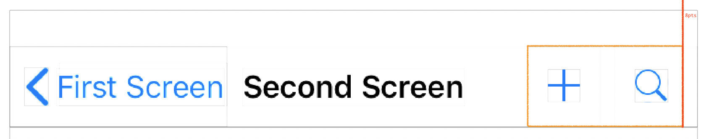

当我们使用了 custom view 的时候，边距到屏幕是 16 个点

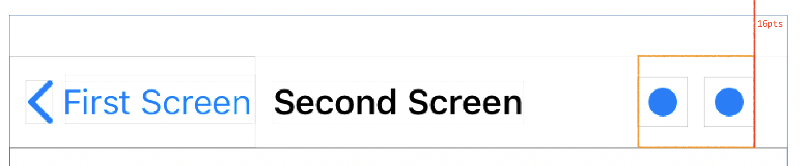

根据上面的发现，我们的目标是：让 custom view 的边距在 iOS 11 上面依然是 8 个点。添加一个 `fix space item` 将会使得内部的 stack view 减少边距，那么修改 `alignmentRectInsets` 的值去移动 `custom view` 的 frame，可以使内部的 stack view 对齐。

```
func alignedBarButtonItems() -> [UIBarButtonItem] {
    let spacer = UIBarButtonItem(barButtonSystemItem: .fixedSpace, target: nil, action: nil)
    spacer.width = 8
    let barButtonsItems = [
        spacer,
        UIBarButtonItem(customView: createCustomButton(offset: spacer.width)),
        UIBarButtonItem(customView: createCustomButton(offset: spacer.width)),
        ]
    return barButtonsItems
}

func createCustomButton(offset: CGFloat = 0) -> UIButton {
    let button = CustomButton(frame: CGRect(x:0, y: 0, width: 24, height: 24))
    button.alignmentRectInsetsOverride = UIEdgeInsets(top: 0, left: -offset, bottom: 0, right: offset)
    button.translatesAutoresizingMaskIntoConstraints = false
    return button
}
```

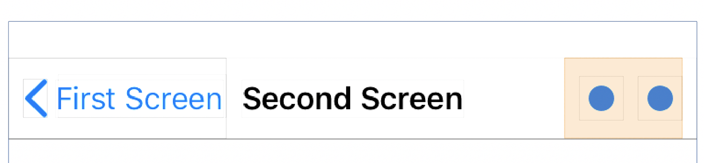

目前来说，这个 workaround 只能将边距设置为 8，如果我们将这个值设为一个更小的值，那么custom view 依然会超出 stack view。


### 参考

* [UIBarButtonItem & iOS 11][URL_Ref1]
