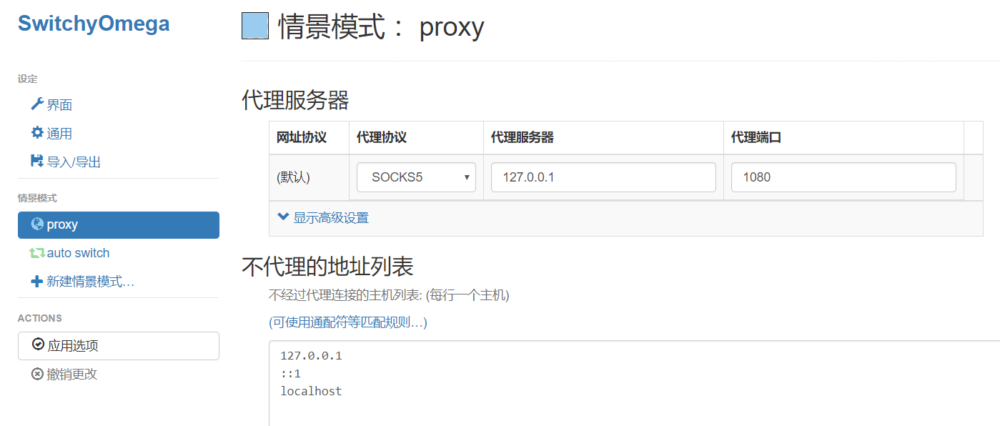
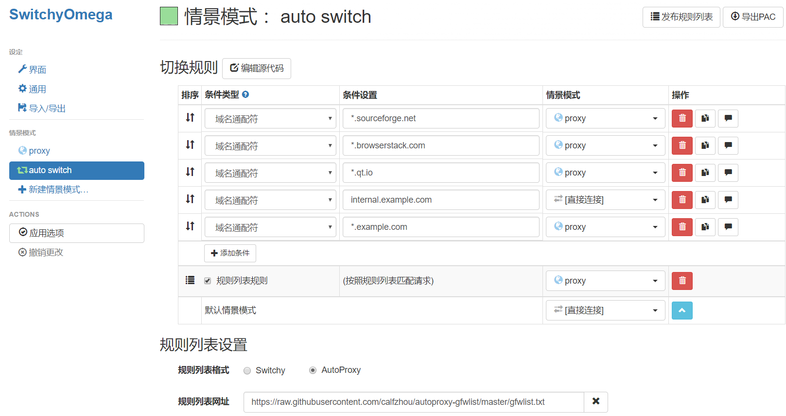
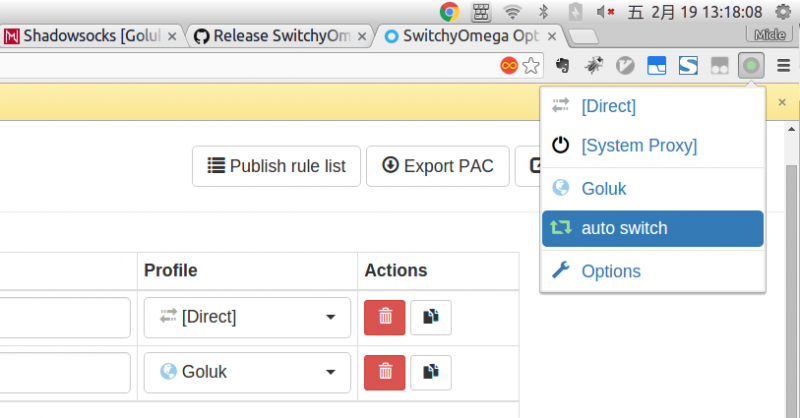

[bootstrap_url]: https://bootstrap.pypa.io/get-pip.py
[ss_account_url]: #免费ss账号

> Shadowsocks：科学上网利器

- [shadowsocks](https://shadowsocks.org)

## 安装

Mac和Linux都默认有Python环境，直接使用Python的包管理器pip安装shadowsocks。

首先，下载pip的自动安装脚本[bootstrap][bootstrap_url]


- 安装shadowsocks

```
$ sudo python get-pip.py
$ sudo pip install shadowsocks
```

- 新建添加配置文件 ss.config，可根据自定义的路径。配置账号进入[免费ss账号][ss_account_url]

```json
{
  "server":"119.28.12.237",
  "server_port":51236,
  "local_address":"127.0.0.1",
  "local_port":1080,
  "password":"NdPaStaBLEyA",
  "timeout":60,
  "method":"aes-256-cfb",
  "workers":1
}
```

- 启动和关闭（ss.config在 root 目录下）

```
$ sudo	sslocal	-c ss.config -d	start
$ sudo	sslocal	-c ss.config -d	stop
```

## 使用
### SwitchyOmega
下载Chrome插件：[SwitchyOmega.crx](https://github.com/FelisCatus/SwitchyOmega/releases)，进行本地安装。

#### 配置Profile
根据以上配置设置：

  * Protocol: **SOCKS5**
  * Server: **127.0.0.1**
  * Port: **1080**





#### 配置自动切换
> 根据规则自动切换使用代理，实现访问限制网站走代理，国内网站直连。

  * Rule List Format: **AutoProxy**
  * Rule List Url: **https://raw.githubusercontent.com/calfzhou/autoproxy-gfwlist/master/gfwlist.txt**




#### 使用SwitchyOmega




## 免费ss账号
- [https://github.com/Alvin9999/new-pac/wiki/%E8%87%AA%E5%BB%BAss%E6%9C%8D%E5%8A%A1%E5%99%A8%E6%95%99%E7%A8%8B](https://github.com/Alvin9999/new-pac/wiki/%E8%87%AA%E5%BB%BAss%E6%9C%8D%E5%8A%A1%E5%99%A8%E6%95%99%E7%A8%8B)
- [https://freessr.win/](https://freessr.win/)

## 参考
  * Shadowsocks: [https://shadowsocks.org/](https://shadowsocks.org/)
  * Shadowsocks @Github: [https://github.com/shadowsocks/shadowsocks](https://github.com/shadowsocks/shadowsocks)
  * SwitchyOmega @Webstore: [https://chrome.google.com/webstore/detail/proxy-switchyomega/padekgcemlokbadohgkifijomclgjgif](https://chrome.google.com/webstore/detail/proxy-switchyomega/padekgcemlokbadohgkifijomclgjgif)
  * SwitchyOmega @Github: [https://github.com/FelisCatus/SwitchyOmega/releases](https://github.com/FelisCatus/SwitchyOmega/releases)
